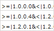

### タグ
マスターの出力判断のためのタグ機能
リリースバージョンまでマスターを公開したくないが、同Excelで管理しているためExcel上では管理したい場合に、バージョンを指定してマスター変換時に出力制御をする
また、以下の様にしていすると各バージョン毎に内容を変更できる


#### 一覧
- ```>=|memo```
  - どのバージョンであっても出力されない
- ```>=|x.x.x.x```
  - 指定バージョン以上で出力される
- ```<|x.x.x.x```
  - 指定バージョン未満で出力される

